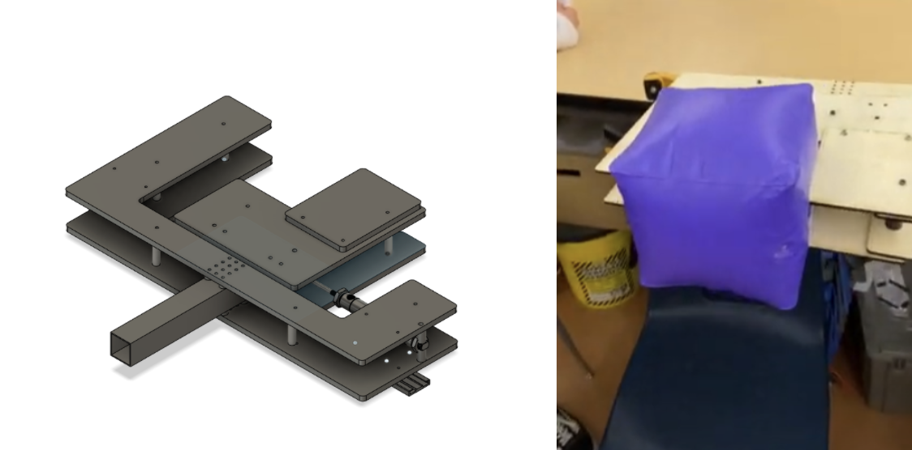
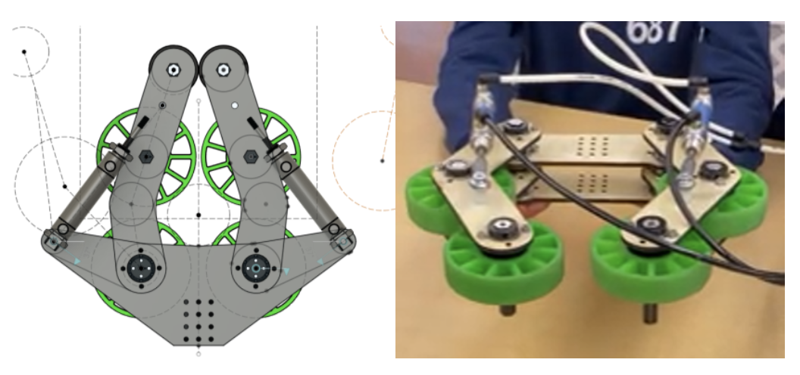
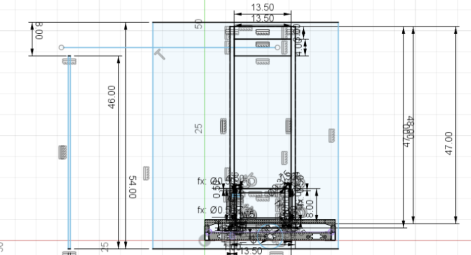
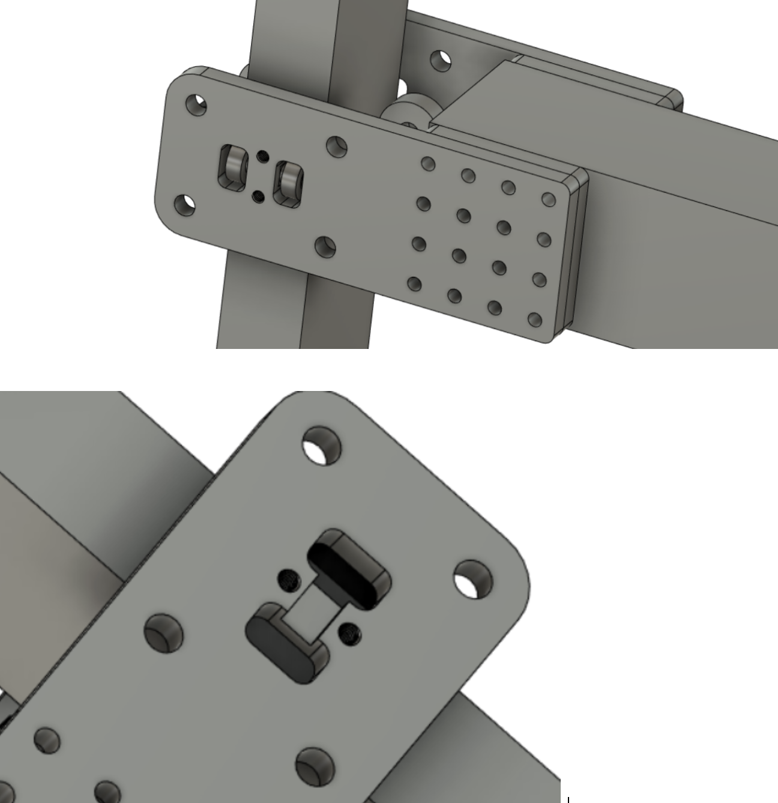
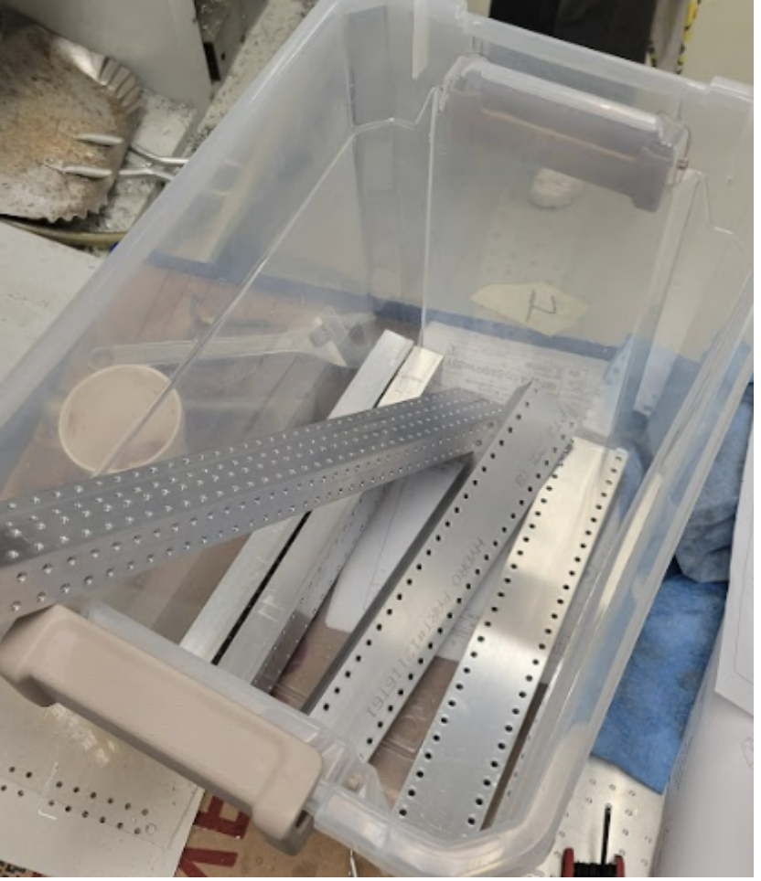
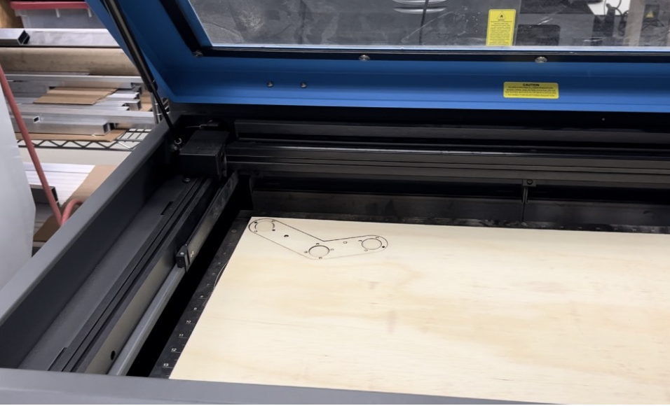
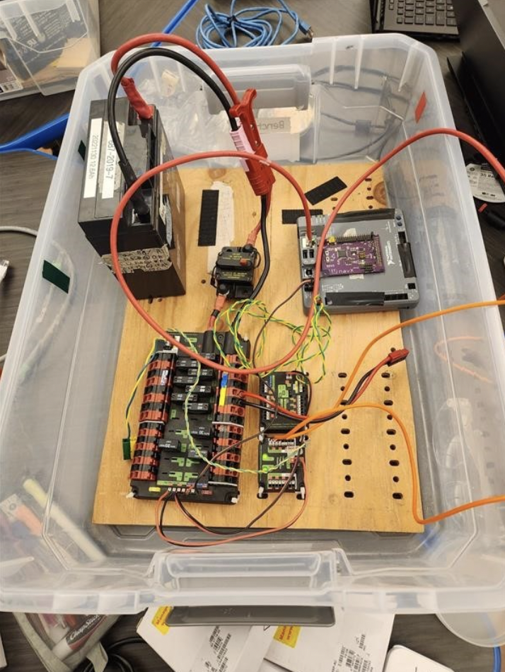

# January 8th Meeting

## Assembly

placeholder

*****

## CAD

### Linear Actuator Claw
The intake subgroup decided to create a 1 piston intake for simplicity and weight. Thid intake had a 100% success rate with the pneumatic test bench. 10 trails each for cone and cube.  

*Linear Actuator Claw CAD and Assembly*

**Links with pneumatic test bench:**

* [Video of Demo for Cube](https://lbschools-my.sharepoint.com/:v:/g/personal/201196108_lbschools_net/EZ_EcZnyBDpEtSZtehS95C4BMwG3_zPayoi-lbAWh9hYQw?e=UaPZtq)

* [Video of Demo for Cone](https://drive.google.com/file/d/1VSm65yeaJ_1Ksp8jqj-Sp_O3lRGFJe8G/view?usp=share_link)

### Rotational Claw CAD/Assembly

We decided to create a 4 point of contact on 4, 4" wheels, supports cones in many configurations, better grip, new cylinder placement will allow for less play (not tested with cylinders yet)  

*Rotational Claw CAD and Assembly*

### Scissor Claw CAD/Assembly

This design is designed to have the functionality to pick the cone on its side and upright as well as to  intake the cube it would get fed by the wheels and end in a diamond shape.  

*Scissor Claw CAD*

*Scissor Claw Assembly*

### Elevator

We spent the day CADing the first design of the elevator. We first made a place for the elevator that doesn’t bump into anything using a crayola sketch. We then created an elevator taking inspiration from our 2019 robot, Gigantor. This was our final product.  

*Elevator Crayola CAD*

*Elevator CAD*

However, while consulting with our main mentor, he mentioned that the weight lighting bars will not be accurate and will take too long to manufacture. He also mentioned that the gusset that holds the bearing will only have 1 full side of bearings and 2 sides only half with bearings, making it more inaccurate. He also mentioned that we did not need to make the carriage long. Taking that into consideration, we decided to start a new iteration that will be closer to what we will first manufacture. 

*Sliding Gusset CAD*

This was the sliding gusset that we had prototyped. This captured both sides, and the bar will be touched 12 bearings.  

*****

## Manufacturing

###Swerve

During pre-season, we CAMed the elevate and up bars (handles) for the swerve drive. This was made for easier transport of the swerve drive. We split into 2 groups (each group working on separate TM-1 CNC mills) and completed the manufacturing of the elevate and up bars. The gussets for these bars were completed prior to kickoff. 

*Handles for Swerve Drive*

###Claw

We also 3d printed and laser cut parts for the claw prototypes. 

*3D-Printing for Claw Prototypes (Linear Actuator Claw)*

*Laser cutting for claw prototype (Rotational Grip Claw)*

*****

## Programming

### Vision, Arm, Claw

Today, our group had two main goals: complete the base repository (with arm and claw subsystems), and recognize April tags using Photon vision. 

Our first goal of completing the base repository was quick, as most of the code was written yesterday. Today we added a method of controlling the arm using percent output and a joystick as a simpler intermediate between newly constructed hardware and motion magic control using PID. The latest version for today can be found [here](https://github.com/nerdherd/ChargedUp2023/tree/387af596c2bf5fcec82245eb6617aae20f59fdf3). 

After the team-wide code review, we marked refactoring changes to be implemented tomorrow. 

Our second goal of recognizing April tags using Photon vision was slightly more difficult. We were unable to open the PhotonVision dashboard and thus not letting us set a static IP address for the limelight, so we continued to use a dynamic IP address which allowed us to identify April tags and read data such as pitch and yaw. 

*Image of testbench setup*

*Image of network switch setup*

### Autonomous Pathing

Today, our group’s goals were to finish creating two simple auto paths (moving backwards and forwards) using tank drive. After the autos were finished programming, we did a systems check on Gigantor (our 2019 robot) so that we could ensure there were no hardware issues with the robot before testing the autos. From the systems check, we found that Gigantor’s chain was skipping. Due to this hardware issue, we were unable to test the autos.  

### Swerve

Today our group’s goals were to update our swerve drive code to WPILib 2023 and be able to run it on the robot. The upgrading process itself was relatively straightforward, with the only major code change being having to convert Swerve Module states into Swerve Module Positions, as in 2023 WPILib, SwerveDriveOdometry updates using Swerve Module Positions, which contain the distance travelled and the angle of one swerve module, rather than Swerve Module States, which contain the speed and angle instead. We ran into several issues, such as there not being an official NavX library for WPILib 2023, and a strange issue where all angles were rotated by 90 degrees. We applied temporary fixes to most of these issues, as we were short on time, using an unofficial NavX library in place of the official one (which can be found here: https://github.com/rzblue/navx-frc) and manually applying a rotation to all angles. We also tested driving onto the mock charging station that our assembly team built but we were not able to drive onto it, as the frame would hit the ramp of the charging station before the wheels were able to contact it. 
