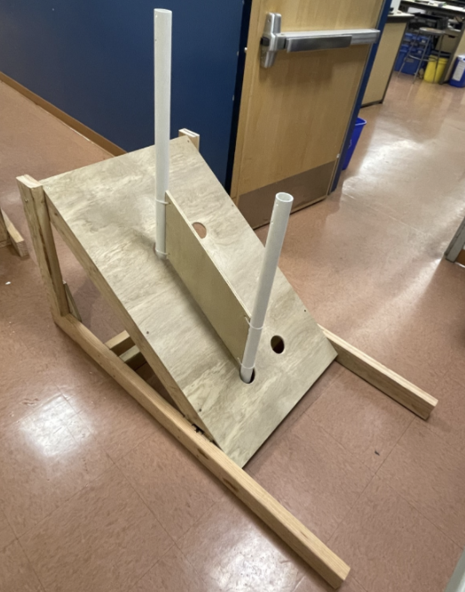
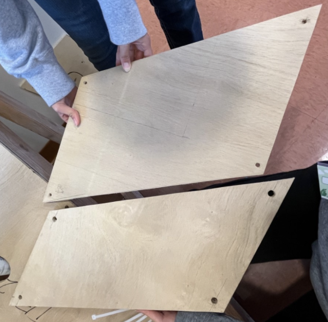
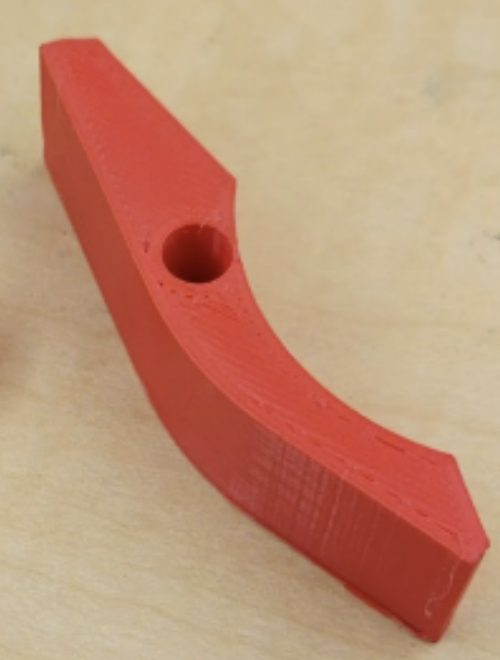
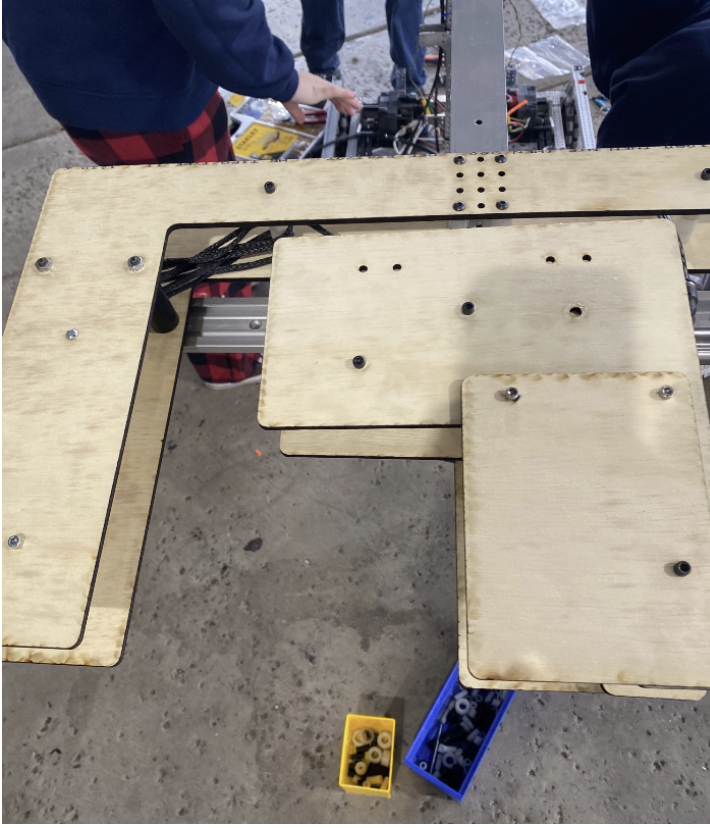
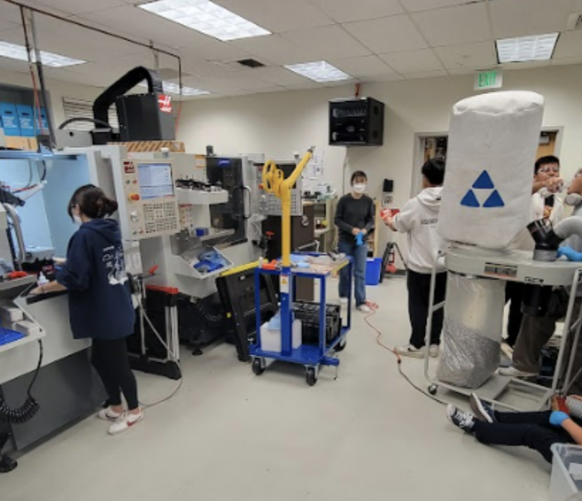

# January 9th Meeting

## Admin

All of Admin worked on pins today. We each made a number of designs and collectively decided which ones we’d use for competitions. We concluded that we’d have competition-exclusive pins and change the design for every competition we go to. We decided to have 2 standard game-focused designs and 3-4 unique ones. We handled lunch today with Raising Cane’s and were able to distribute everything with ease. After lunch, we took inventory of fronts and backs for pins in order to decide how many we’d need for the season. We set the goal of 700 per competition, totaling 2100 for the entire season. Afterwards, we began the Admin BOM for any necessary materials we needed. Media finalized editing for the second recap video and gathered footage for the third recap video. We sent out the food order forms for next Friday and Saturday and collected some money for the first day. Some Admin members worked on the parent kick off flyer, which was to be sent out to parents with the RSVP form (since there’s limited seating). A few other members started updating the website, and some others worked on tonight’s McDonald’s dinner. Though it was rainy, we were able to easily distribute food. After, we made a few pins to show Mr. Harder along with the final stand-up banner design and parent kickoff flyer. 

*****

## Asssembly

### Field Elements

For the end cone ramp, we measured, cut, and finished assembling it



*End Cone Ramp*

**Fixes:**

* Charge station / drive base – we removed a bar on the drive base that was over the wheels, allowing for the robot to go on the ramp 

* Middle cone ramp – we redid the shark fin after fixing angel measurements



*Fixed Cone Ramp Shark Fin* 

### Claw Prototypes 

We had assembly members help build/work on two of the claw prototypes. We taught some of our assembly members and members from other subteams about pneumatics and how to use the manual pneumatic test bench. Using the test bench, we tested two of the claw prototypes. 

### Electrical on Prototype Bot  

We made connections between the two boards as well as connecting our drive motors to the PDP. We also connected all our CAN wires. 

Drive: 3 cim ball shifter with 3 falcon 500 motors (x2; one gearbox on each side) 


*Electrical on Prototype Bot* 

### Pneumatics on Prototype Bot 

We ziptied the airtank down but it had a leak, so it was replaced. Made all pneumatic connections. (Pictured above) 

* Storing Pressure: 120 psi 

* Working Pressure: 60 psi 

* Rated Tubing: ¼", 125 psi  

* Drive shifting (1 solenoid) 

* Claw open and close (1 solenoid) 

---

## CAD

```{admonition} Note

This section is being updated. Please return later for more information.
```

## Manufacturing

### Swerve

With the completed Up and Elevate bar and the gussets, we assembled the handles on the swerve drive. 


*Completed assembly of the handles for swerve drive.*

### Elevator & Claw

We also 3D printed parts for the claw/intake prototypes (Elevator and Scissor Claw; respectively) 


*Printed elevator parts.*



*Printed Scissor Claw part.*



*Laser cut linear actuator prototype and assisted with the assembly*

### Other

We also 3D printed a cover for the Navx on the roborio.


*Finished print of the Navx cover.*

All the machines (TM-1 and the Super Mini Mills) and the vises were cleaned for Friday.  



*Cleaning the machines*

---

## Programming

### Vision

Today, our goal was to drive within range of and align to an April tag using a tank drivebase. We began with a code review with a mentor and then merged our testbench code with the main repository: ChargedUp2023. We then referred to PhotonVision documentation to implement an aim at target method. This method used a PID loop with the error being the yaw difference between the target and limelight.  


*Vision Code Sample*

Our implementation of distance finding between target and camera was similar: where distance was used as the error for a PID loop. After implementing this functionality using documentation, however, we found there was a high error (anywhere from 10 to 90 meters of error) when printing the distance. After manually calculating distances and ensuring the built-in equation (see below) was correct for our use case, we realized the high error was because of our low accuracy when measuring the height of the camera and the height of the limelight. 


*Built-in Equation*

### Radio Configuration

Additionally, we found that two radios we owned would not establish communications on driver station. This issue could also be seen on the indicator lights on our network switch, where the light corresponding to the radio would not turn on (see image below). This was likely because they were not configured, and a future goal is to ensure at least one of our laptops is reliable when configuring radios. 


*Network switch with all indicator lights off.*

### Swerve

Today, our goal was to finish testing swerve drive code on 2023 and begin programming commands such as turning to an angle and automatically balancing on the charging station. We found that most of our issues from yesterday were due to the encoders becoming offset. We were able to fix this by resetting the encoders to the same position as the absolute encoders, using this method: 


*Code sample that reset the encoders to the same position as the absolute encoders.*

After fixing the program, we were able to have our driver test driving the swerve drive. We then added a low pass filter and scaled the input quadratically to make the driving more comfortable for them, using these lines of code: 


*Code sample for the low pass filter and scaled the input quadratically*

We used both the low pass filter and the quadratic filter last year, so we used nearly the same implementation as our Rapid React code in this project. 

While our driver tested the swerve drive, our assembly subteam set up their new mock charging station, which now has a layer of plexiglass on top to more accurately match the real charging station. This allowed our swerve drive to climb the charging station. After a bit of practice, our driver was able to regularly climb the charging station and park on top of it.  

Afterwards, the swerve drive was given to the assembly subteam to add handles and bumpers to it. While assembly worked on the drivebase, we continued in development, writing a new command for turning to an angle based on the NavX’s readings, adding javadoc comments and more documentation to our code, and refactoring some of the classes to be more readable. After Assembly finished, we were able to drive onto the ramp even with a bumper on the robot, showing us that swerve drive may be a feasible choice for this season. However, we still need to fix much of our code, as it lacks important functionality such as in-game autonomous routines, and some functions, such as turn to angle, either weren’t tested or don’t work. We plan to fix these soon and implement them in a swerve drive auto. 

### Autonomous Code

Today, our goal was to finish writing up the auto commands and writing a drivetrain code that extends from the differential drive train class on WPILib.  By testing on the prototype bot and Thomas (our 2020, 2021 robot), we found out that the code we wrote for the drivetrain did not work so we shifted to the code from yesterday and tested.  We discovered that there were some issues with one of the Falcon motors in the drive and wrong inversions on the right side of the drive base; however, we were able to troubleshoot by using Phoenix Tuner to check what they were inverted to and editing code as needed.  

### Claw

We also tested the claw code and found out that we were using faulty solenoids, so we switched them out and successfully controlled the claw. 
