# Week 2 (1/13 to 1/20)

## Assembly

### Training

We conducted training for new members (Rotations):  
Motor testing 
- Used phoenix tuner and driver's station 
- Recorded motor data in a spreadsheet and labeled motors 

Comp maintenance 
- Pit checklist  

Taught Pneumatics 
- How to use the manual test bench 
- Layout and components of prototype bot pneumatics

Soldering

Chain Tensioning 
- Practicing chain tensioning by using Allen wrenches to tie and loosen snail gears 

### Claw

Once the assembly of the double piston claw was done, we attached it to the prototype bot.  

*Image of the completed claw assembly*

We fixed a claw prototype’s cone compression.

*Demo of claw holding cone*

We tested a claw prototype 
- Set up pneumatic test bench and tested the two-piston claw design. It was successful for both the cone and the cube. 

We finished the assembly of the claw prototype. Upon completion, it was tested and successfully picked up and scored a cone on the node about 4 times until the wood snapped while testing.  

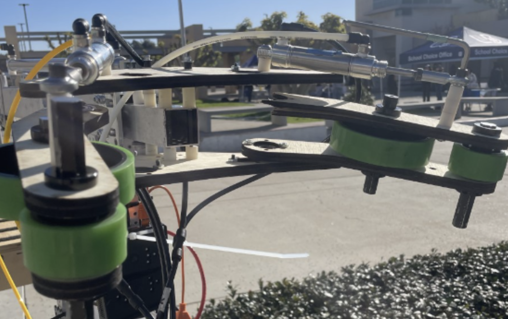

*Broken wood on claw prototype*

### Arm

Installed the piston on arm 
- Tubing  
- Wires

*Piston attatched to claw prototype*

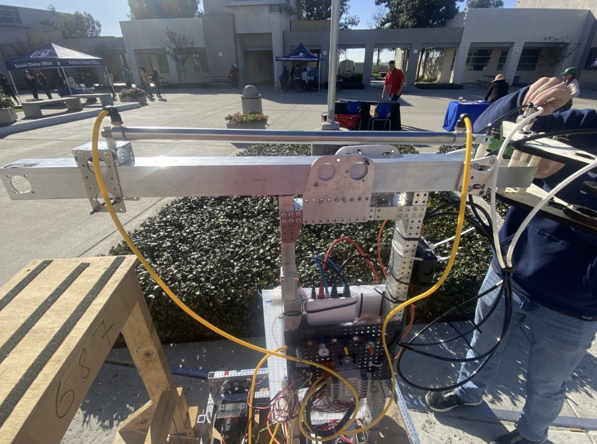

### Elevator

We also worked on the elevator prototype: 
- Worked with CAD in assembly of the elevator 
- Took inventory for elevator parts 
- Riveted U shape 

*The start of our elevator prototype*

### Cone Runner

We worked on the assembly of the cone runner intake prototype. 
- Once assembled, we tested it.

*Assembled cone runner intake prototype*

Video of the intake working: https://drive.google.com/file/d/1Y-SxlztuHSmEjaizDpQcaamlR35QkoNe/view?usp=sharing

### Field Elements

We finished assembling the end cone ramp. 
Connected the cube shelf divider beam to cone ramp horizontal beam using wood screws and spacer plywood 

*Image of the completed Cone Ramp.*

Made a substation height simulator (Double Substation Stand) 
- Cut wood and assembled 

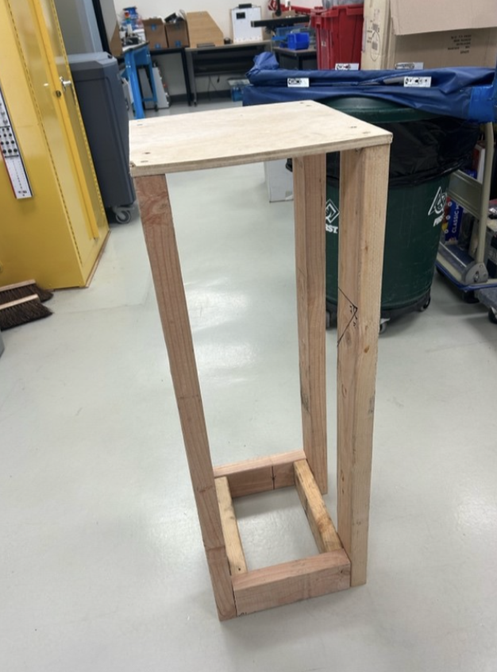

*New double substation stand*

### Robot Repairs/Maintenance

We did several repairs on our prototype bots such as: 
- Fixed CAN on prototype bot 
- Fixed gearboxes on prototype bot 
- We finished attaching handles onto our swerve bot. 

*Handles on Swerve*

We fixed a Pneumatic Leak in our Prototype Bot: 
We found slanted tubing, so we cut a new tube and reconnected it 

### Robot Cart

We continued brainstorming and designing a new robot cart. We completed the following:  
After the brainstorming on Friday, we made the 1st iteration design and reviewed those designs with our advisor 

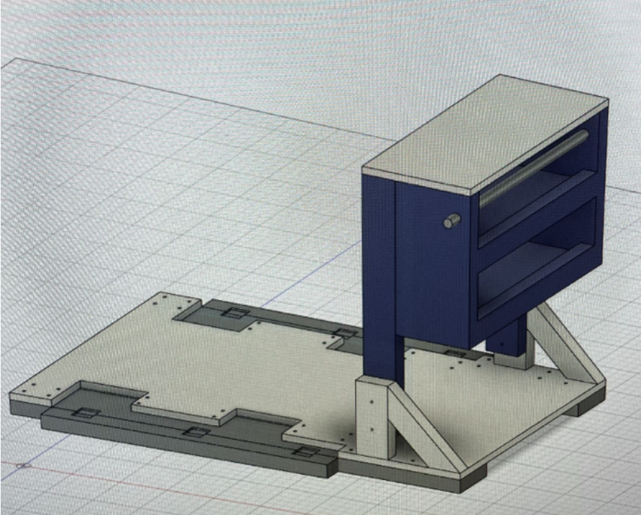

*CAD design of new robot cart*

We continued to work on Robot Cart.  
- Got feedback from advisor 
- Created a 2nd iteration 
- Started Bill of Materials (BOM) 

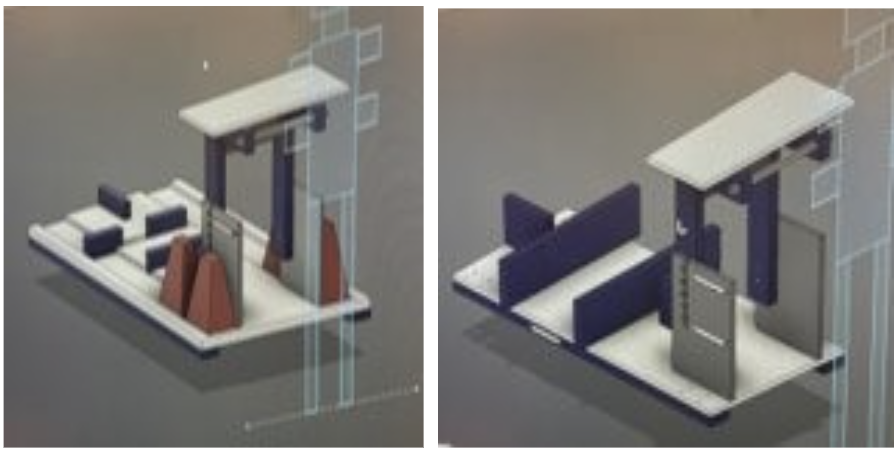

*Two possible designs for the robot cart*

### Driver Station

We began work on a new driver station.  
- Assembled the base of the driver station. 
- Used the bandsaw to cut bars for the base and polycarb. 

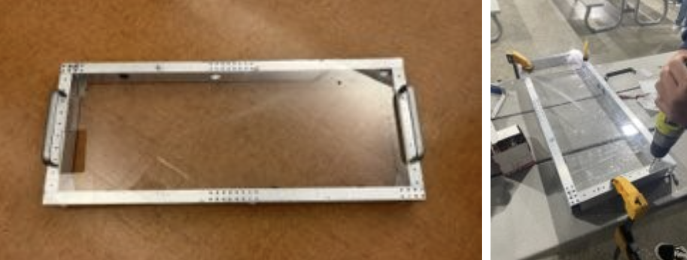

*Finished driver station base*

### Other

We repaired the Wooden Dolley our team uses to push around large materials. 
- Replace broken plywood 
- Stapled fabric using staple gun 

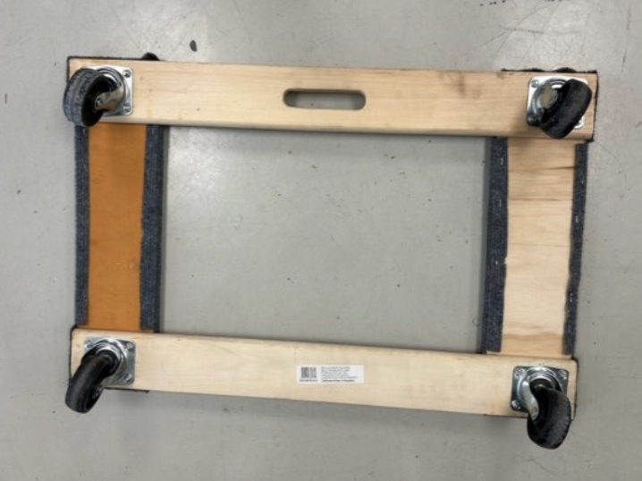

*Fixed Wooden Dolley*

We also assembled versaplanetary gearboxes for our prototype bot. 

We started working on our new robot cart and driver’s station. 
- brainstorming updated designs 
- design constraints 
- additional features

We recorded inventory for the following components: 
- Cone Runner 
- Motor 

Did basic battery maintenance: 
- Battery Leads: take off and replace battery leads. Use heat gun to secure heatshrink.
- Tested 2 batteries with a computerized battery analyzer

Made changes to encoder connection (NEOs): 
- Spliced 24AWG onto 28AWG onto neo motor encoder wires 

We Disassembled telescope climb to get more parts needed for other claw prototypes:  
- Bearings 
- stock 

We recorded inventory for versaplanetary gearboxes.  

Some assembly members had Manufacturing Training on: 
- Work offsets 
- Helping MFG with parts list 
- Facing, probing 

We performed the following electrical work: 
- Prepared CANcoders for 2nd swerve 

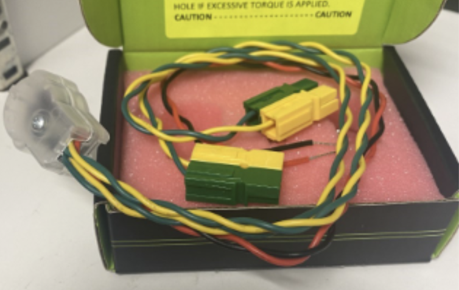

*Completed encoder preparation*

We helped the ADMIN sub team with the following: 
- Created FRC sponsors Stickers 
- Started design for sponsorship panels 

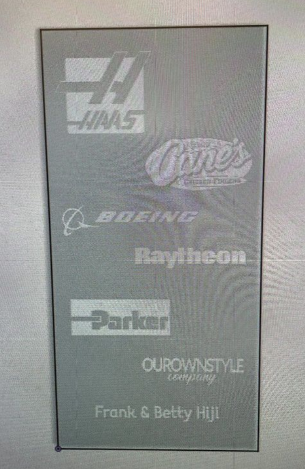

*Image of our sponsor panel layout*

## CAD

### Telescope Arm

First cad of two stage telescope arm. Each tube is 27 inches long. Received feedback. Need to find a way to move the arm. Thinking of attaching motor to elevator carriage. 

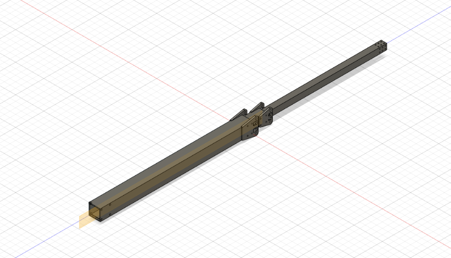

*Screenshot of arm CAD*

### Elevator

We finished updating the elevator. Some of the updates included making the bars into 29 inches to make it easier for manufacturing. We created drawings of all the parts, and created a BOM that we must order to make the elevator.  

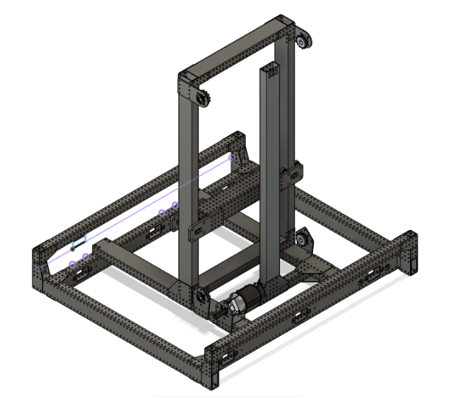

*Screenshot of elevator CAD*

### Swerve Bumpers

After testing dimensions with a current swerve drive base docking and engaging we completed the swerve bumper design with technical drawings from those dimensions. We wanted to make the process of taking off bumpers and putting them back on as easy as possible. We went with a pin design with 4 c-channel mounts with two on opposite sides. 

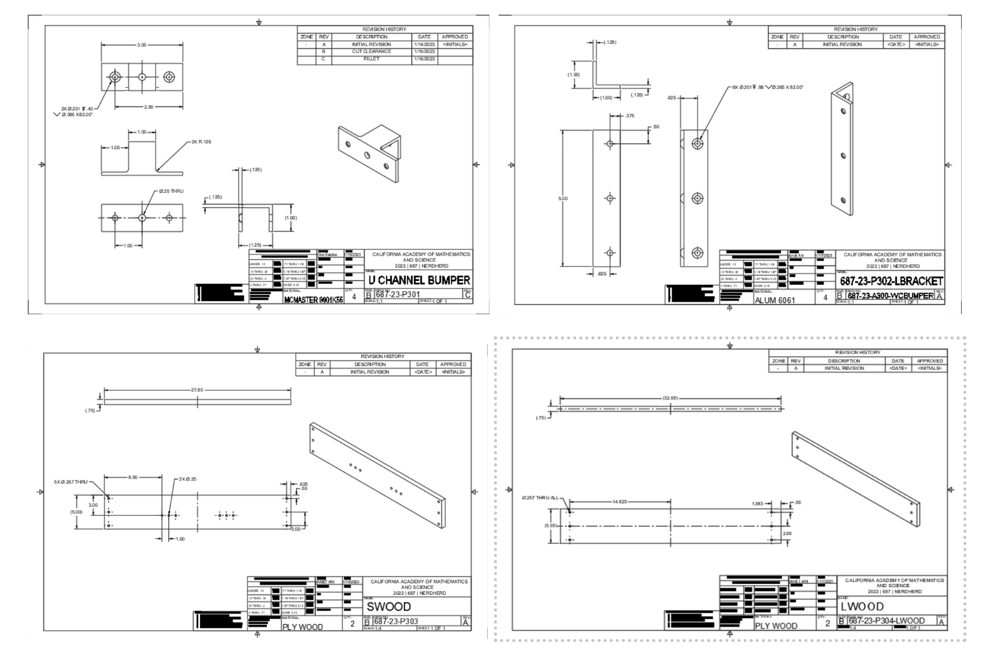

*Screenshots of the drawings for our swerve bumpers*

### Rotational Claw

We then tested the rotational claw with the pneumatic piston test bench and had 100% success rate out of 10 trials with cone and cube.

*Screenshot of the claw cad.*

## Manufacturing

The manufacturing subteam set up a 3D printer with TPU filament and another with Nylon X to test the usability of the various materials. We printed a test belt with the TPU, which proved to be successful. We also reorganized and lowered our stock rack so that we could add more shelves and create a more efficient storage area for manufacturing. Furthermore, the side guards on the TM-1 were removed in preparation for the elevator bar. The TM-1 vises and work surface, as well as the side guards, were vacuumed and cleaned with oil. 

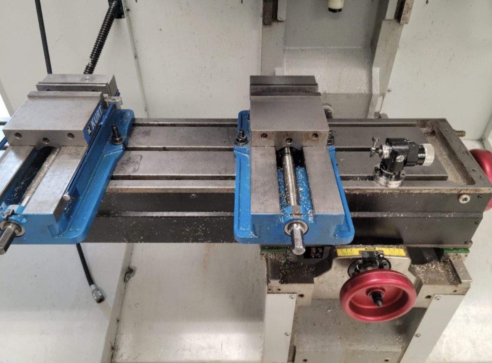

*A close-up of the tidied bare TM-1 work surface. *

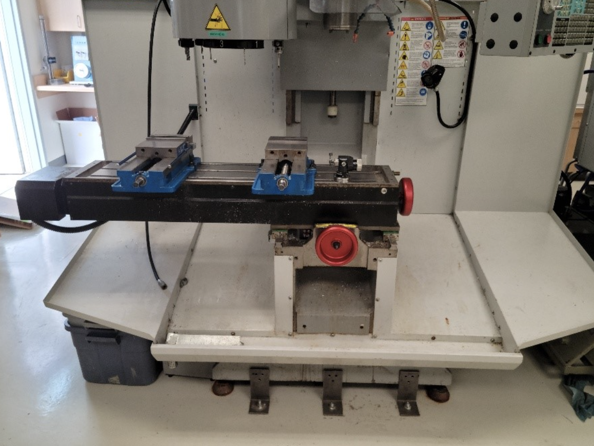

*A full shot of the TM-1 with its guard railing removed.*

*A selfie shot of the people who busted their butts and worked through approx. 10 machine cloths to get this baby nice and shiny.*

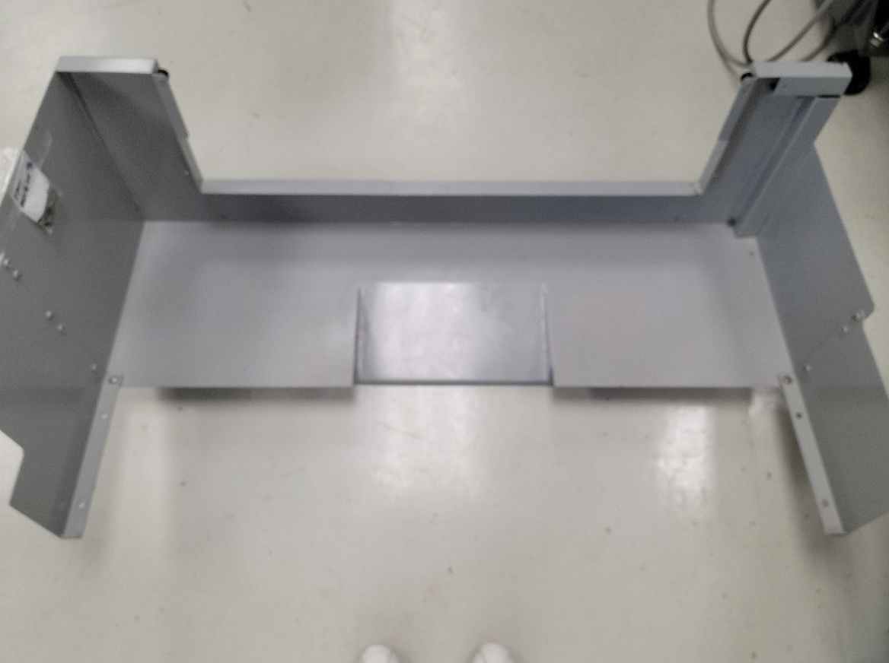

*A full shot of our cleaned guard railing with its screws and washers (for connection to the TM-1) taped on to ease reattachment + the tips of my feet (how scandalous). *

## Programming

#### Vision Group

This week, we learned that there are two methods of determining the robot’s distance from the april tags using the Limelight. The first method uses the angle and the height of the camera along with the angle and height of the april tag to determine the distance from the camera to the target. It also uses the angle from the Limelight to the target which is the value that is changed to help determine the distance between the Limelight and april tag. However, if the numbers were slightly off, then the distance would be changed exponentially. That is why we decided to go with the second method that uses the area of the Limelight which the target takes up. To do so, we had to find an equation to determine how the area of the target relates to the distance between the Limelight and the april tag. We tested the turning using the pitch received from the Limelight, and it was successful 

#### Auto Group

First, we continued testing the drive and claw functionalities of the prototype bot. For the sides of the drive base that had an unused motor, the motor current ramped up to around 178 amps.  The removal of the motor resulted in the motor current ramping up to only around 30-40 amps, which is a safe amount.  Next, we tested autos that drove straight and faced a certain angle using a NavX, but they need further PID tuning. We have also tested several buddy climb iterations.  There were some successful trials; however, the swerve drivetrain was unable to stay on the buddy climb for most trials. 

#### Swerve Group

This week, we worked on adding smaller features to our codebase. First, we transferred some of the swerve commands we had written, such as turn to angle using the gyroscope and charge station balancing, to be compatible with a west coast drivetrain, as at this point, we were not sure which drivebase we would be committing to. After that, we worked on adding logging to the robot, first testing using the WPILib DataLog framework (https://docs.wpilib.org/en/stable/docs/software/telemetry/datalog.html) on a testbench, and then writing code to implement it into our subsystems. We hope that this will solve some of our slowdown issues from last year, when we used BadLog (https://github.com/dominikWin/badlog) for logging, as DataLog does I/O operations on a separate thread, which should reduce slowdown. 
