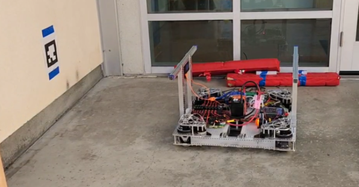
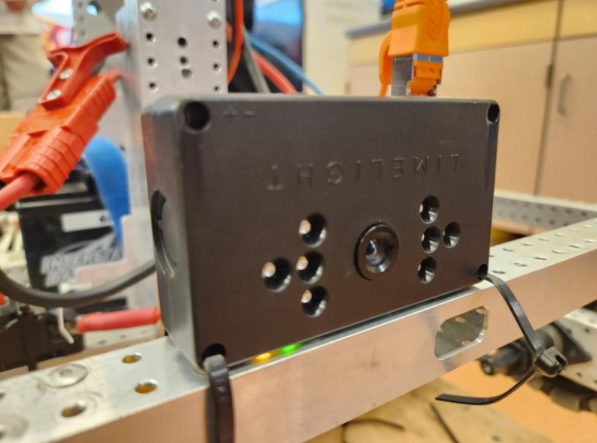

# Week 3 (1/21 to 1/28)

```{admonition} Under Construction
This page is currently under construction. Please return later for more updates.
```

## Assembly


## CAD


## Manufacturing


## Programming

### Vision Group

#### 1/23

We got the April Tag and Object Detection to work on a single limelight. The 4 objects being the cones, cubes, tape, and April Tags. Our code allows us to have the robot drive toward a target object while also making any angle corrections along the way. 


Later in the day, we refactored the aimAt_Object_() methods into one aimAt() method which allows the code to choose to target any of the 4 object types in one line only by entering in an enum: “CONE”, “CUBE”, “TAPE”, “TAG”. 

```java
public static enum TargetType {
   CONE,
   CUBE,
   TAPE,
   TAG 
}
```

The object detection works so well that we can tape an object to a moving person and have the robot chase them around completely autonomously. As an extra feature, we implemented a move back algorithm which has the robot drive backwards if the object were to get too close. 

#### 1/27

We worked on implementing vision with the swerve drive. We did this by creating a command that combined the turnToAngle command and the driveToTarget command. We were able to test our code on the actual swerve drive, but it didn’t work. One of the possible errors was that the PID values needed to be tuned a little bit. 



*DriveToTarget testing, robot oscillated in place*

#### 1/28

We refactored our code for vision with the swerve drive. We switched the xSpeed and ySpeed values because the y and x axes are switched. 

Tested the previously broken limelight and it works now. Also reflashed the limelight with photonvision firmware to have limelight firmware. 

Tested our refactored code. The code seems to work but the values were flickering because the limelight was wavering between not detecting the apriltag and detecting the apriltag. So, we need to tune the limelight more. 



*Previously broken but now functional limelight*

### Swerve Drive Group

This week, we worked on writing and testing auto paths. 

First, we tested a simple auto path that moved in a 1-by-1 meter square. While testing, we found that our odometry calculations were incorrect and were missing compensation for the swerve modules’ gear ratio. After adding the gear ratio into the calculation, we found that the auto path worked relatively well, although it was not accurate over long distances on concrete. 

Afterwards, we tested a longer auto that started on the right side of the field, “scored,” picked up a game piece, “scored,” picked up another game piece, “scored,” and then went to the charging station. We found that this auto worked relatively reliably on carpet but took too long to run. Even after increasing our max velocity and acceleration for the auto, we found that we could not score the third game piece in time.  

During driver testing of the swerve drive, they suggested adding a stow command, which turns all wheels to a 45-degree angle to make the swerve drive impossible to move, as well as adding turn to 0- and 180-degree commands to the driver controls, as this gave them easier maneuverability. After implementing these commands, we tuned the PID values on our swerve modules’ turning motors, as they were overshooting before. We used the live graphs from AdvantageScope in order to tune the PID. 

Lastly, we then tested integrating our balancing command into the auto. We created a new auto that directly went to the charging station, and then tested it on our charging station mockup. We found that, although it worked, the charging was slow due to us not having a separate P-gain value for initially climbing up the ramp.  


Because of this, we modified our auto to have two stages for the charging: one with a higher P-gain for going up the ramp, and one with the original P-gain for balancing once on the charging station. We then tested stowing the wheels at the end of the command but found that it was unreliable and sometimes would even cause the swerve drive to slowly slide off the ramp. 

```java
public class TimedBalancingAct extends SequentialCommandGroup {
    public TimedBalancingAct(SwerveDrivetrain swerveDrive, double period1, double kP1, double kP2) {
        super(
            new ParallelRaceGroup(
                new WaitCommand(period1),
                new TheGreatBalancingAct(swerveDrive, kP1)
            ),
            new TheGreatBalancingAct(swerveDrive, kP2)
        );
    }
}
```

*Our timed balancing command*